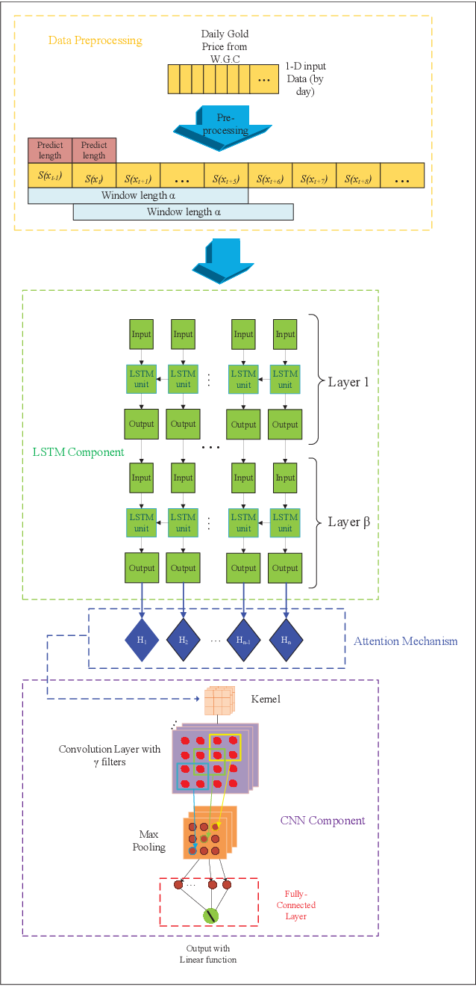
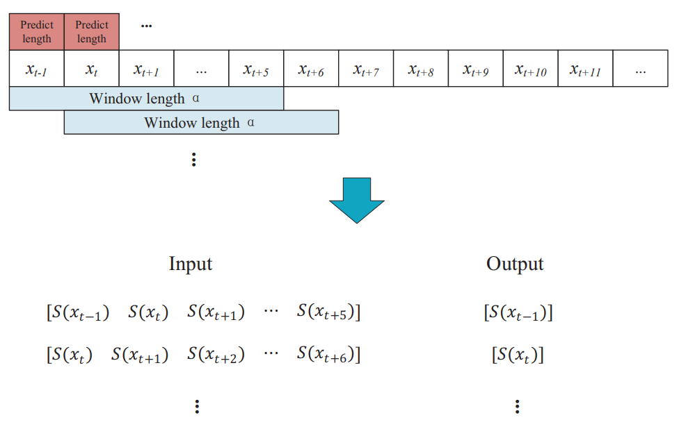
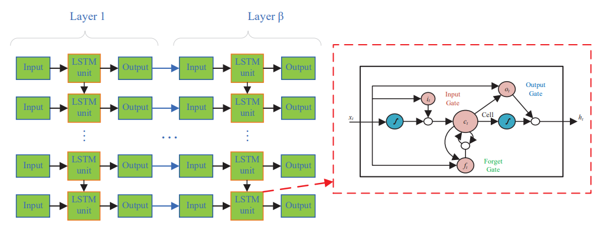
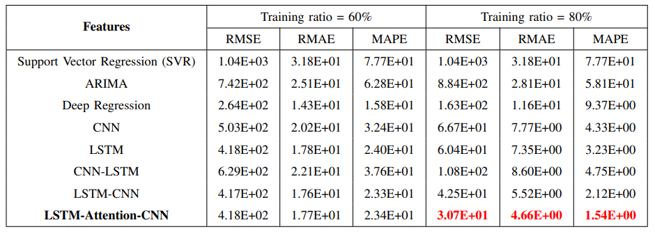

# Gold Price Forecast based on LSTM-CNN Model

## Outline

- Motivation & Background
- Main Contributions
- Our Approach
- Experiments
- Conclusion
- 출처

## Motivation

- 정확한 예측은 매우 중요하다.
- 금융은 계산 집약적이다.
    - 내부 요소들 (예: 현금 흐름)
    - 외부 요소들 (예: 정부 규제)
- 수리적 모델에의 적용 (예: 베이즈 알고리즘)
- 정량적 요소 모델에의 적용 (예: Capital Asset Pricing Model)
- 2008년 금융위기 이후 중요성이 대두됨

## Background

- 한편 그시기에 딥러닝은 여러 분야에서 두각을 빠르게 나타내고 있음
- 이론적으로 우리가 비정형 데이터를 가지고 오더라도 딥러닝은 그 속에서 관계(패턴)를 찾아낼 수 있음
- 이러한 점에 주목해 LSTM and CNN model with Attention 메커니즘을 사용할 것임

## Main Contributions

- 우리는 일일 금 가격 예측을 위해 LSTM-CNN model with Attention 메커니즘을 제안한다.
- 우리가 제안한 모델이 다른 전통적 모델들에 비해 더 좋은 성능을 보여준다는 것을 증명하기 위해 우리는 대규모의 실험을 진행한다.
- LSTM-CNN 모델이 CNN-LSTM 모델보다 더 좋은 성능을 보여준다는 것을 발견했는데 이는 CNN-LSTM 모델에 비해 lower feature 손실이 적었기 때문이다.
- 우리는 또한 Attention 메커니즘이 우리의 모델에서 매우 중요한 부분이 된다는 것을 발견했으며, 순수 LSTM-CNN 모델과 비교했을 때 유의미한 성능 향상을 이끌어낸다.

## Our Approach

- 위 그림처럼 방법론은 네 가지 부분으로 이루어져 있다.
    - Data Preprocessing
    - LSTM Component
    - Attention Mechanism
    - CNN Component

### 1. Data Preprocessing

- 데이터를 모델에 입력하기 전에 우리는 standard scale method (*denoted as S(x)*)를 사용해야 한다.
- 입력의 길이를 α만큼 설정해야 한다.
- 위 사진 예시에 따르면 α의 크기는 7이며, 이는 각 입력 매트릭스가 7일분의 데이터를 담고 있다는 것을 의미한다.
- 출력 데이터는 대응되는 입력 데이터의 첫 번째 요소이다.

### 2. LSTM Component

- LSTM 레이어는 β 길이만큼 생성되며, 각 레이어는 Input 레이어, LSTM 유닛, Output 레이어 세 단계로 구성되어 있다.
- LSTM 유닛은 Input 게이트, Output 게이트, Forget 게이트 총 세 개의 게이트로 구성되어 있다.
- 셀은 정보를 저장하는데 사용되며, forget 게이트는 정보를 기억할지 잊을지 결정한다.
- 계산 이후 Output 레이어는 모든 결과를 모은 뒤 다음 단계인 Attention 메커니즘으로 전송한다.

### 3. Attention Mechanism

- LSTM Component 단계 이후 우리는 새로운 인코딩 시퀀스를 얻는다.
- 하지만 이 시계열 입력 데이터의 large scale 때문에 LSTM Component 단계에 더 많은 데이터를 주입할수록 LSTM 구조에서 더 안좋은 영향이 발생하며, 이는 각 LSTM 유닛에서 처리된 정보가 포함된 메모리의 품질이 저하된다는 것을 의미한다.
- 따라서, 시간적 또는 공간적 특징에 상관없이 이 새로운 시퀀스에 직접적인 영향을 미치게 된다.
- 새로운 인코딩 시퀀스에서 효과적인 정보를 더 잘 파악하기 위해 시간적 특징들에 대해 attention 가중치를 높인다. 이 단계는 매우 중요하다.
- 그리고 CNN Component에 전송된다.

### 4. CNN Component

- CNN은 특징 추출 및 재구성에 능하다.
- 이곳에서는 일일 금 가격의 공간적 특징을 감지한다.
- 또한 CNN 속 필터의 개수를 설정해야 한다.
- 필터를 거지고 난 데이터는 최종적으로 예측 결과를 만들어내기 위해 Fully-connected layer에 입력된다.

## Our Approach

왜 이런 순서로 모델을 구성해야 하는가?

먼저, LSTM-CNN 구성과 CNN-LSTM 구성을 비교해보면 LSTM-CNN 구성이 더 좋은 예측 결과를 보여준다는 것을 다음 섹션에서 볼 수 있다.

## Experiments

### Experiment Setting

- Data
    - World Gold Council (WGC)에서 발표한 데이터셋을 사용한다.
        - 1978년 12월 29일부터 2019년 2월 15일까지 10,471개의 일일 금 가격을 포함한다.
    - Performance Metrics
        - **Root Mean Square Error (RMSE)**: 예측 에러를 나타내기 위해 사용
        - **Root Mean Absolute Error (RMAE)**: bias(practical & predictive model)를 측정하기 위해 사용
        - **Mean Absolute Percentage Error (MAPE)**: 예측 정확도를 나타내기 위해 사용
        - **MSE (Mean Squared Error)**: 손실을 표현하기 위해 사용

### Results

- Training ratio = 80%일 때를 보면 attention 메커니즘이 중요한 역할을 하고 있음을 알 수 있다.
- 결과를 보면 CNN-LSTM 모델이 LSTM-CNN 모델보다 성능이 낮은 것을 볼 수 있다.
- CNN Component는 로컬 패턴을 추출하고 재구성하는 것에 능한데 두 모델의 입력 데이터를 보면 한쪽은 원본 입력 데이터이고 한쪽은 시계열 입력 데이터이니 로컬 패턴을 추출하는 데에는 당연히 시계열 입력 데이터가 유리할 수밖에 없다.
- CNN output이 LSTM component로 넘어가면 LSTM 모델은 시간적 특징의 추출이 불가능해진다.
- 이것이 LSTM-CNN 순서로 모델을 구성하는 이유이다.

## Conclusion

- LSTM-CNN model with Attention 메커니즘은 효과적으로 일일 금가격 예측을 수행할 수 있다.
- Attention 메커니즘은 예측을 최적화할 수 있다.
- 순차적 모델의 구성 순서는 중요한 요소이다.
- 문제에 따라서 우리의 모델을 구축해야 한다.

## 출처

- Z. He, J. Zhou, H. Dai and H. Wang, "Gold Price Forecast Based on LSTM-CNN Model," 2019 IEEE Intl Conf on Dependable, Autonomic and Secure Computing, Intl Conf on Pervasive Intelligence and Computing, Intl Conf on Cloud and Big Data Computing, Intl Conf on Cyber Science and Technology Congress (DASC/PiCom/CBDCom/CyberSciTech), Fukuoka, Japan, 2019, pp. 1046-1053, doi: 10.1109/DASC/PiCom/CBDCom/CyberSciTech.2019.00188.
